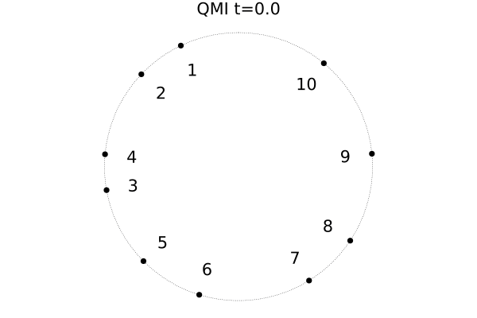

Our new paper, *[Pair localization in dipolar systems with tunable positional disorder]()*, has recently been published in Physical Review B!

Here is a small visualization of the short-time dynamics of 10 spins in a 1D chain with periodic boundaries:

Shown is the quantum mutual information $QMI(A,B) = S(A)+S(B)-S(AB) $ between all single spins. The line's thickness is roughly proportional to the QMI with QMI values smaller than $10^{-5}$ not drawn at all. 
