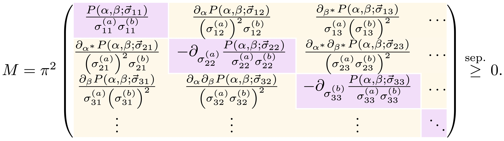
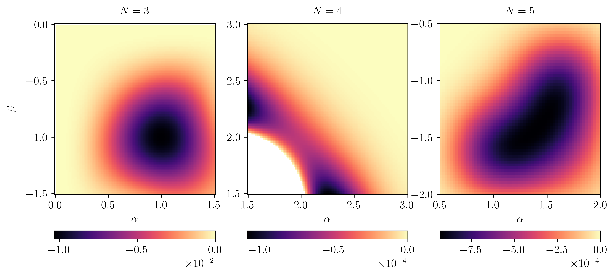

---
title: Detecting entanglement using only local features of phase-space distributions
subtitle: 
date: 2026-05-05
authors:
- callus
image:
  filename: NOON_Husimi_345.png
  focal_point: Smart
  preview_only: false
  caption: "Witnessing entanglement in various NOON states by probing strategic regions in phase space."
projects:
- entanglement
tags: 
links:
  - icon_pack: fas
    icon: arrow-circle-right
    name: Publication
    url: /publication/callus-2026/
---

<figure>
    
    <figcaption>A matrix representing separability criteria in terms of phase-space distributions and their partial derivatives at a single coordinate in phase space.</figcaption>
</figure>

The detection of entanglement in an experimentally accessible way remains a challenging task, especially for continuous-variable systems. In our work, [arXiv:2602.21688](https://arxiv.org/abs/2602.21688), we show how entanglement can be revealed by considering the property of phase-space distributions at only a single coordinate point.

Phase-space distributions are a convenient way of fully describing states of continuous-variable systems. This means that all information about, say, nonclassicality and entanglement is also captured by these distributions. Although there exist entanglement witnesses formulated in terms of phase-space distributions, these require knowledge of the full distribution or, at least, its marginals. Hence, accessing this information experimentally is a very resource-expensive task.

We have developed an infinite hierarchy of witnesses which are formulated in terms of only the value of a phase-space distribution, and its partial derivatives, at a single point. This greatly reduces the amount of knowledge required from a given distribution!

From a mathematical standpoint, such an approach makes sense: since the distributions we consider are analytic, all the information about the full distribution is captured by all its partial derivatives at an individual point. It turns out, then, that in order to witness entanglement, we only need to access part of this information. We also show that our hierarchy of witnesses is equivalent to the PPT criterion when tuning all distributions to the Husimi distribution.

In order to demonstrate the power of this approach, we consider the lowest-order witness that can detect cross-mode correlations. By choosing strategic locations in phase space, such a witness can detect entanglement in, e.g., NOON states, two-mode entangled cat states and random states. These are all examples of states where second-order witnesses either fail or work in a very limited regime.

<figure>
    
    <figcaption>Witnessing entanglement in various NOON states by probing strategic regions in phase space.</figcaption>
</figure>

Finally, our approach is also experimentally accessible. We show how violation of our separability criterion can be experimentally verified by simply measuring the joint photon-number distribution of the two modes, both with and without interfering on a beamsplitter. This simplifies for the Husimi-based criterion, where only the probabilities of the vacuum and the single-photon state need to be estimated.

Warm thanks to Tobias Haas for collaborating on this project!
