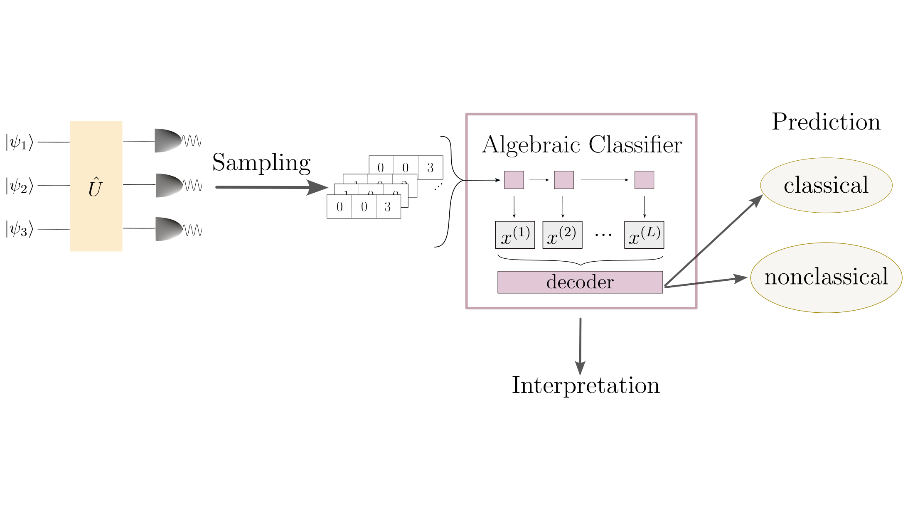

---
title: Learning to detect optical nonclassicality
date: 2026-03-06
authors:
- jung
- gaerttner

projects:
- multimode-bosoic-systems

tags: ['nonclassicality', 'quantum optics', 'machine learning']

links:
  - icon_pack: fas
    icon: arrow-circle-right
    name: Publication
    url: https://arxiv.org/abs/2603.06319
---

## Learning to detect optical nonclassicality

Asking for the nonclassicality of a quantum state first seems like an obvious question, 
as quantum mechanics is known to be inherently nonclassical. However, the notion of optical nonclassicality 
is more subtle and describes a state’s potential to produce entanglement at a beam splitter. Entanglement is known 
to be a necessary resource for many quantum cryptography protocols. Hence, nonclassicality is a valuable resource and 
there already exists a bunch of different nonclassicality witnesses that provide sufficient criteria to detect nonclassicality. 
However, these witnesses do not account for the fact that some states are more likely to be observed than others in a given experiment.

In our work, we introduce a variational model that learns to distinguish classical from nonclassical states using measurement 
samples of multimode quantum states that are probed with different photon-number-resolving (PNR) detection schemes. 
Whereas traditional analytical nonclassicality witnesses have to be carefully adapted to the used experiment, our data-driven 
approach allows the model to handle arbitrary detection schemes, like time-bin multiplexed click detectors. 
Furthermore, the model is interpretable in the sense that the learned decision rule can be extracted after training. 
In combination with a regularization of the learned weights, this yields a compact, observable nonclassicality criterion.

We demonstrate that the model realizes a unique combination of high expressivity and full interpretability, outperforming 
traditional witnesses in experimentally relevant scenarios, including time-bin multiplexing and click detection schemes. 
Furthermore, the generalization of the model to multiple modes is shown on a setup with a 6-mode random unitary and 
PNR superconducting nanowire single-photon detectors.

If you are interested in the details, have a look at our publication: https://arxiv.org/abs/2603.06319
